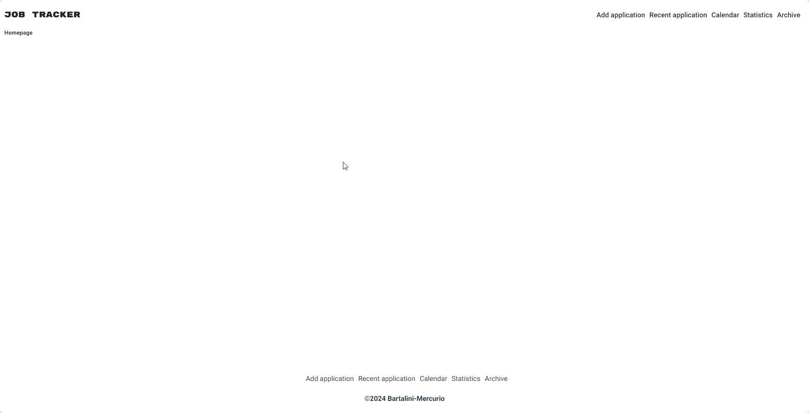
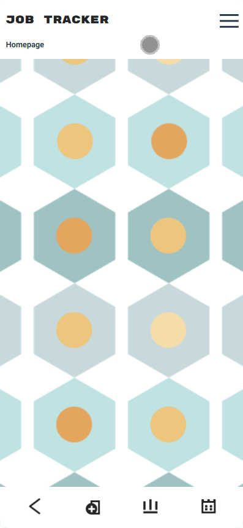

# Job-Tracker
The application (work in progress!) will help the users to keep track of their job applications, and to quickly review the tests/interview outcomes.

Mobile UX/UI Design by Francesca Bartalini

Desktop:


Mobile:


**Getting Started**
Prerequisites
Node.js and npm installed

**Installation**

1. *Clone the repository*: https://github.com/StefaniaMerc/Job-Tracker.git

2. Navigate to the project directory:
   
   ```cd your-repo-name```

3. Install dependencies:
   
   ```npm install```
   
4. Running the app
   
   ```npm run dev```

This will start a development server and you will be able to run the project on your browser.

License
This project is licensed under the MIT License.
